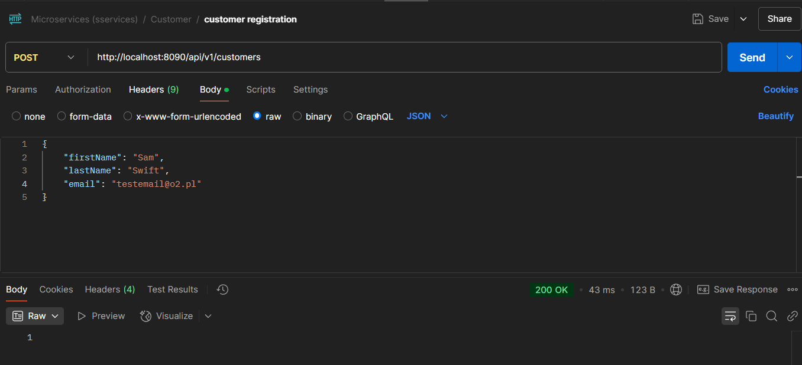
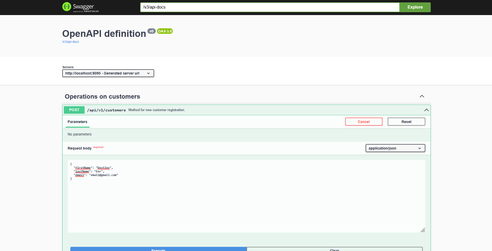

# Microservices Application
This repository hosts a microservices-based application utilizing Service Discovery, Load Balancing, Spring Cloud, Spring Cloud Gateway, Eureka, and Spring Boot. The project serves as a practical implementation to enhance understanding and skills in microservices architecture.

## Table of Contents
* [General Info](#general-information)
* [Technologies Used](#technologies-used)
* [Features](#features)
* [Screenshots](#screenshots)
* [Setup](#setup)
* [Usage](#usage)
* [Project Status](#project-status)
* [Room for Improvement](#room-for-improvement)


## General Information
This project was developed as a hands-on exercise in microservices, demonstrating key architectural principles and patterns.

## Technologies Used
- **Java**
- **Eureka Server**
- **Docker**
- **Spring Framework**
- **OpenAPI**
- **Spring Cloud Gateway**

## Features
- Create a customer through a RESTful API.
- Validate email format and check for duplicate email addresses.


## Screenshots



## Setup
Before running the application, define the following global environment variables:
- `DATABASE_URL`: The URL for connecting to the database (e.g., `jdbc:postgresql://localhost:5432`).
- `DATABASE_USERNAME`: The username for the database.
- `DATABASE_PASSWORD`: The password for the database.
- `DATABASE_NAME`: The name of the database.

Ensure that the database credentials are correct for the application to function properly.

To start the application, build all JAR files and execute the following command:

```bash
docker-compose up --build
```

## Usage
This application can be utilized as a basic model of microservices.

- To create a customer, send a POST request to:
  ```
  http://localhost:8090/api/v1/customers
  ```

- To check if a customer is flagged as fraudulent, use the following endpoint:
  ```
  http://localhost:8090/api/v1/fraud-check/{customerId}
  ```

Additionally, you can access the API documentation via OpenAPI at:
```
http://localhost:8090/swagger-ui/index.html
```

## Project Status
The project is currently **completed**.

## Room for Improvement

Potential extensions could include:

    Adding new functionalities and features.
    Implementing additional microservices for more complex operations.
