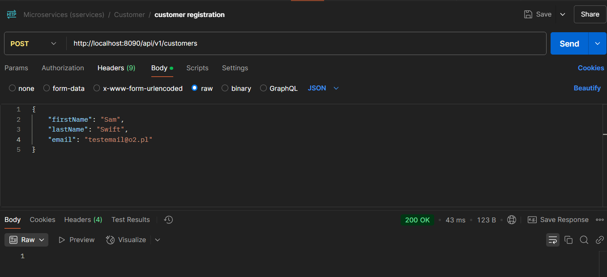
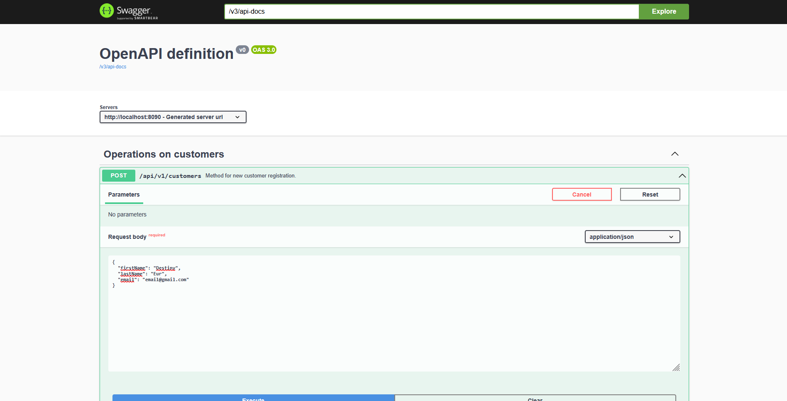

# Microservices Application

This repository hosts a microservices-based application using Service Discovery, Load Balancing, Spring Cloud, Spring
Cloud Gateway, Eureka, and Spring Boot. The project is a practical implementation to demonstrate microservices
architecture patterns.

## Table of Contents

- [General Information](#general-information)
- [Technologies Used](#technologies-used)
- [Features](#features)
- [Screenshots](#screenshots)
- [Setup](#setup)
- [Usage](#usage)
- [Project Status](#project-status)
- [Room for Improvement](#room-for-improvement)

## General Information

This project was developed as a hands-on exercise in microservices, demonstrating key architectural principles and
patterns.

## Technologies Used

- Java
- Eureka Server
- Docker
- Spring Framework (Spring Boot, Spring Cloud)
- OpenAPI / Swagger
- Spring Cloud Gateway

## Features

- Create a customer via a RESTful API.
- Validate email format and check for duplicate email addresses.
- Basic fraud-check microservice example.

## Screenshots




## Setup

Create a .env file in the root of the project (you can copy from .env.example if available) and define the following variables:

- `DATABASE_URL`: Full JDBC connection string for PostgreSQL
  e.g. `jdbc:postgresql://postgres:5432/customer`
- `DATABASE_USERNAME`: PostgreSQL username (e.g., `postgres`)
- `DATABASE_PASSWORD`: PostgreSQL password
- `POSTGRES_DB`: Name of the database created in PostgreSQL
  (must match the database name used inside `DATABASE_URL`)
- `EUREKA_URL`: Eureka service URL used by all microservices (e.g., `http://eureka-service:8761/eureka`)

Ensure all values are consistent across services and that the database container is reachable before starting the applications.
```bash
docker compose --env-file .env up --build
```

This command will:

- Build all service images
- Start PostgreSQL, Eureka, and microservices
- Inject environment variables from `.env`
- Connect all services through the Docker network
## Usage

- Create a customer (POST):
  http://localhost:8090/api/v1/customers

- Check fraud status for a customer (GET):
  http://localhost:8090/api/v1/fraud-check/{customerId}

- API documentation (Swagger / OpenAPI):
  http://localhost:8090/swagger-ui/index.html

## Project Status

The project is currently completed.

## Room for Improvement

Potential extensions:

- Add more microservices and inter-service communication examples.
- Implement distributed tracing and centralized logging.
- Add automated tests and CI/CD pipeline.
